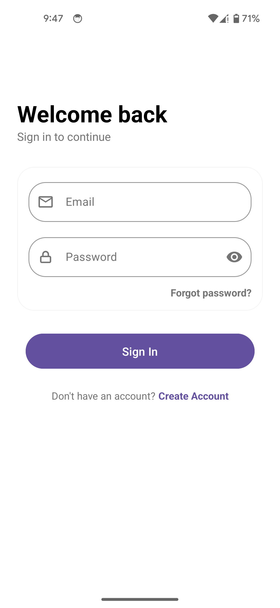
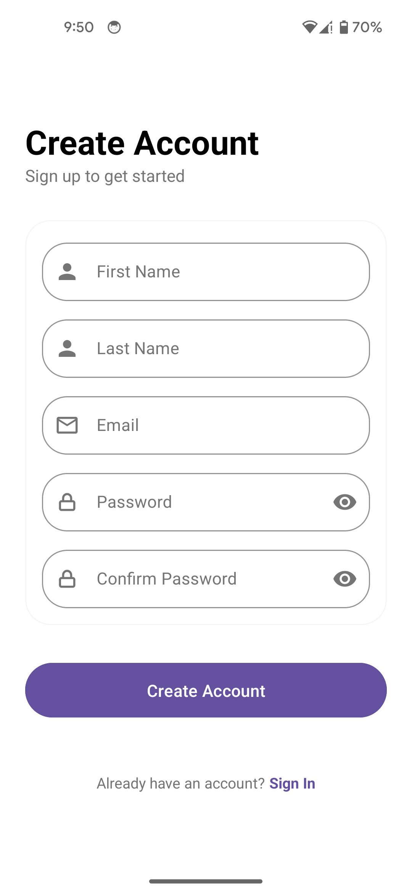
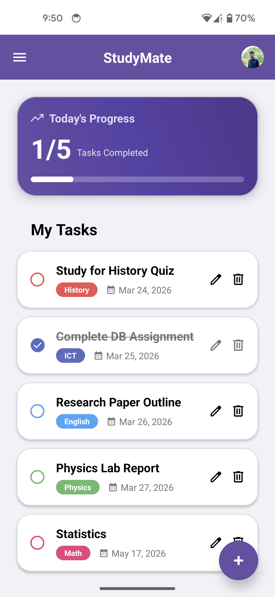
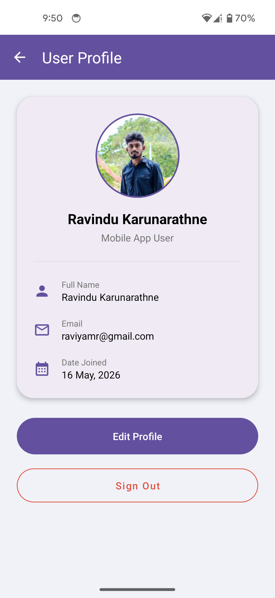

# StudyMate 📚

StudyMate is a powerful and intuitive Android application designed to help students manage their daily tasks, track productivity, and stay organized. Built with a modern UI and real-time cloud synchronization.

## ✨ Features

- **User Authentication**: Secure Login, Signup, and Password Reset functionality powered by Firebase.
- **Task Management**: Create, edit, delete, and organize your study tasks with ease.
- **Real-time Synchronization**: All your tasks and profile data are synced across devices using Cloud Firestore.
- **Progress Tracking**: Visualize your daily achievements with a dynamic progress bar on the home screen.
- **Profile Customization**: Personalize your profile with a name and profile picture (stored efficiently as Base64 in Firestore).
- **Modern UI/UX**: Designed using Material 3 guidelines with smooth animations and intuitive navigation.
- **Developer Info**: A dedicated section to learn more about the creator.

## 🛠️ Tech Stack

- **Language**: Java
- **UI Framework**: Android Material Components (Material 3)
- **Backend**: Firebase Authentication, Cloud Firestore
- **Image Loading**: Glide
- **Data Handling**: GSON for local caching/JSON processing

## 🚀 Getting Started

To get a local copy up and running, follow these simple steps:

1. **Clone the repository**
   ```bash
   git clone https://github.com/raviya/StudyMate-Android.git
   ```

2. **Add Firebase Configuration**
   - Create a project in the [Firebase Console](https://console.firebase.google.com/).
   - Add an Android app with the package name `lk.mrraviya.studymate`.
   - Download the `google-services.json` file.
   - Place the file in the `app/` directory of the project.

3. **Enable Firebase Services**
   - Enable **Email/Password** authentication in the Firebase Auth section.
   - Create a **Cloud Firestore** database in "Test Mode".

4. **Build and Run**
   - Open the project in Android Studio.
   - Sync Gradle files and run the app on an emulator or physical device.

## 📸 Screenshots

| Login | Signup | Home | Profile |
|-------|--------|------|---------|
|  |  |  |  |

## 👨‍💻 Developer

**Ravindu Karunarathne**  
Undergraduate at University of Colombo  
Bachelor of ICT

---
Developed with ❤️ for Students.
